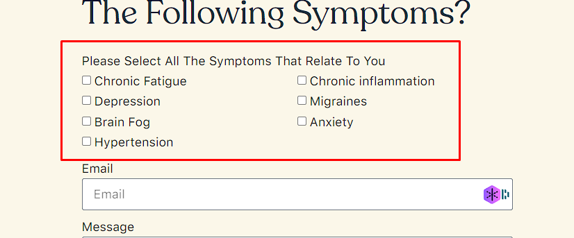

# Add Extra Custom CSS

This is For Elementor From check On two-line Css

<figure><figcaption></figcaption></figure>

```
selector span.elementor-field-option {
    flex-basis: 50% !important;
    box-sizing: border-box;

}
```
